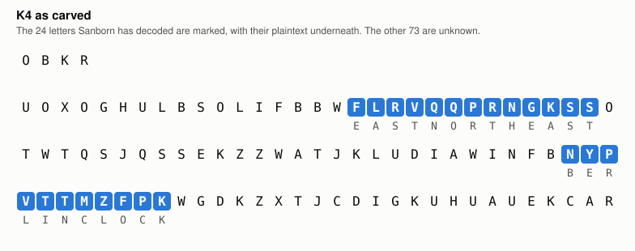
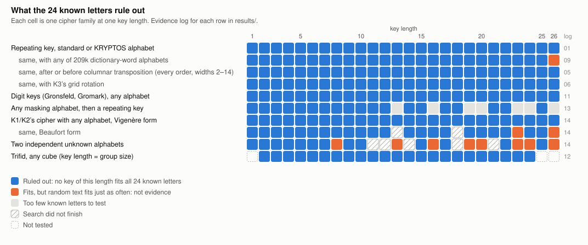

# kryptos

[](https://github.com/keithadler/kryptos/actions/workflows/ci.yml)
[](https://github.com/keithadler/kryptos/releases/latest)
[](https://github.com/keithadler/kryptos/blob/main/LICENSE)

**Kryptos K4, searched in the open.** What the 24 letters Sanborn has revealed rule out, with every
claim checked against planted ciphers. No solution here. This is an honest map of why.

*Kryptos* is a copper sculpture by Jim Sanborn at CIA headquarters in Langley, Virginia, installed
in 1990. It carries four encrypted passages. The first three (K1–K3) were cracked by 1999, using a
Vigenère cipher keyed with the word KRYPTOS for K1 and K2 and a transposition for K3. The fourth,
**K4**, is 97 letters long and has never been publicly solved.

Its answer does exist. In 2025 two journalists found it in Sanborn's papers at the Smithsonian,
and those files are now sealed until 2075. The archive sold at auction, and the buyer, Paradigm,
checks submitted answers for $1 each without learning the solution. But neither the text nor the
method has been published. The only public evidence is the carved ciphertext and 24 letters of
plaintext that Sanborn released between 2010 and 2020: EAST NORTHEAST and BERLIN CLOCK.

<picture>
  <source media="(prefers-color-scheme: dark)" srcset="docs/k4-carved-dark.svg">
  
</picture>

This repo uses those 24 letters as hard constraints. For each kind of cipher, the question is:
*could any key of this kind turn the carved letters into EAST NORTHEAST and BERLIN CLOCK at the
right places?* If no key can, that cipher is ruled out. That's a proof, not a guess. Every search
is also run on a fake ciphertext with a known answer planted in it, and it has to find it. And
every apparent hit is compared with what random letters produce under the same test.

## What's ruled out

<picture>
  <source media="(prefers-color-scheme: dark)" srcset="docs/map-dark.svg">
  
</picture>

Also ruled out:
- running keys taken from the K1–K3 solutions, the sculpture itself, Howard Carter's *The Tomb of
  Tut-ankh-Amen* (the source of K3) and the Bible;
- a running key from *any* English or German text with the plain or KRYPTOS alphabet: the key the
  clues force isn't language, and isn't made of the Berlin World Clock's place names either;
- keys made by a rule instead of a text: a formula in the position, a recurrence, a key that
  restarts at a chosen letter or at each word, and autokey under any alphabet at short lags;
- the Hill cipher, with or without an added constant, and anything built on a 5×5 square
  (Playfair, Bifid, four-square);
- K1/K2's cipher applied twice (K2 ends with the words "LAYER TWO");
- ciphers that can't turn a letter into itself: position 74 is K→K.

What's left is what 24 letters can't decide: two unknown alphabets at once, long keys, stacked
layers, or a hand method with no clean mathematical form. More plaintext would decide much of it,
and so would **K5**, a second 97-letter passage Sanborn made alongside K4, which Paradigm plans to
release.

**[SEARCH.md](SEARCH.md)** has the full account: the method, the assumptions behind every "ruled
out", each result with its evidence log, guessed-plaintext experiments, and what remains open.

## Run it

```
make verify                 # build, then 33 planted-cipher checks (~45 s)
checks/fetch_texts.sh       # optional: the public-domain texts tried as running keys
checks/reproduce.sh         # regenerate the evidence logs in results/
python3 docs/make_figures.py
```

Python 3 with numpy, and a C compiler.

| Path | What |
|---|---|
| `kryptos.py` | K4, the known letters, the alphabets, the cipher operations |
| `*.py` in the root | One search per cipher family (see SEARCH.md §4) |
| `c/` | The heavy searches in C: transposition, every-column-order, unknown-alphabet solver, annealing |
| `k5.py` | Ready for K5: two messages under one key |
| `verify.py` | The planted-cipher checks |
| `checks/` | Random-text calibration, downloads, evidence regeneration |
| `results/` | The evidence logs SEARCH.md cites |
| `docs/` | The figures and the script that draws them |

## License

Code: MIT. The Wikipedia-derived files in `data/` are CC BY-SA 4.0 (see `data/SOURCES.md`).
